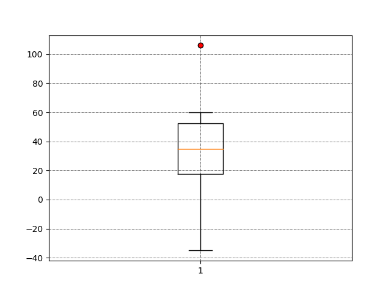
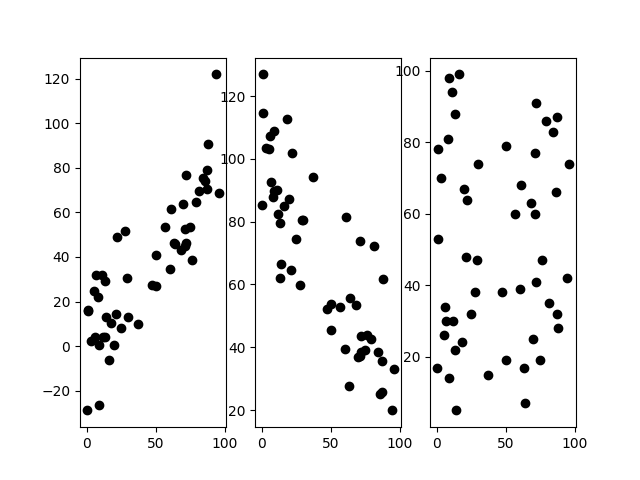
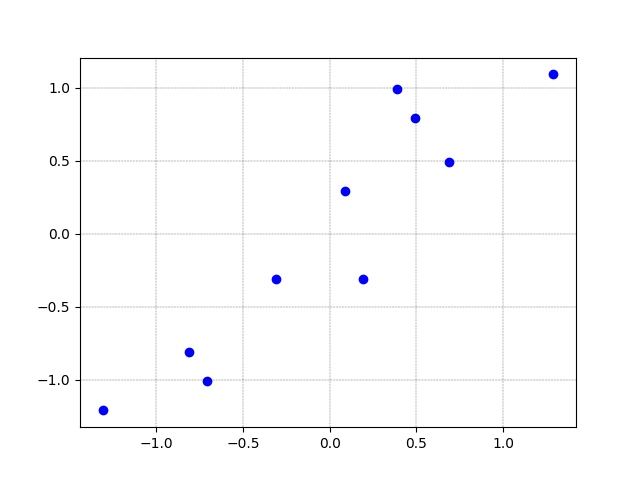
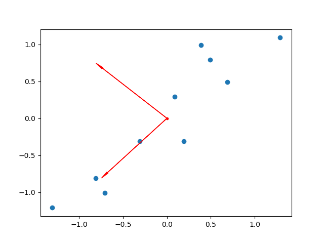

# Bigdates

## 第二章习题

### 1. 如果在没经过预处理的数据集合上进行数据挖掘的话，会有哪些问题？

答 ：

- 无法保证数据挖掘的结果的有效性。
- 数据清洗主要包括数据清洗、数据集成、数据变换、数据归约等内容
- 数据集成：负责解决不同数据源的数据匹配问题、数据冲突问题和冗余问题
- 数据变换：将原始数据转换为合适数据挖掘的形式。包括数据的汇总、聚集、概况、规范化，同时可能需要对属性进行重构
- 数据归约：负责搜小数据的取值范围，使其更适合数据挖掘算法的需要

## 2. 假设如果原始数据服从正态分布，那么经过*z*分数变换后的标准大于3的概率有多大？

答：原数据服从正态分布，经过 ***Z-score***后，服从标准正态分布 ***N(0,1)***, 由正态分布的 ***3sigma***原则可知，
$$
P(X>3)=\frac{1-P(0-3*1\leq X \leq 0+3*1)}{2} = \frac{1-0.9973}{2}=0.00135 \tag 1
$$

## 5. 假设12个销售价格记录如下：6, 11, 205, 14, 16, 216, 36, 51, 12, 56, 73, 93.

### （1）使用等深划分，将其划分为4个箱，16在第几个箱？

答：排序为：6,11,12,14,16,36,51,56, 73, 93, 205,216. 划分四个箱，每三个放入一箱，即[6,11,12,14], [14,16,36],[51,56, 73], [93, 205,216], 16在第二个箱内。

### （2）使用等宽划分，将其划分为四个箱，16在第几个箱？

答: 排序为：6,11,12,14,16,36,51,56, 73, 93, 205,216. 宽度为20，划分四个箱子，6,11,12,14,16,36,51,56, 73, 93, 205,216. 16在第一个箱内。

### （3）利用等深分箱法，将其划分为三个箱，用平均值平滑法进行平滑处理，第二个箱子的取值为多少？

答：排序为：6,11,12,14,16,36,51,56, 73, 93, 205,216.  划分为三个箱，每箱装入四个，即：[6, 11, 205, 14], [16, 216, 36, 51], [12, 56, 73, 93]. 第二个箱子数据为16, 216, 36, 51]，平均数为39.75.

### （4）利用等宽分箱法，将其划分为三个箱，用边界平滑法进行平滑处理，第二个箱子取值为多少?

答：排序为：6,11,12,14,16,36,51,56, 73, 93, 205,216. 
$$
216-6 = 210\tag 2  \\
\frac{210}{3}=70
$$
宽度取70, 即[6-76], [77-147]. [148-218] ，第二个箱子内为[93], 距离77最小边界是93,距离147最小边界是93，所以平滑后为93.


## 程序

### 2-4

```python
import numpy as np
X = np.array([-35,10,20,30,40,50,60,100])
k=25
Xk = np.percentile(X, k,method= 'linear')
Nx = X.shape[0]
indices = 1 + (Nx - 1)*k/100.0
print(indices,Xk)
```

```shell
[Running] python -u "/home/ElonLi/VSCode/Bigdate/Perentile.py"
2.75 17.5

[Done] exited with code=0 in 0.145 seconds
```

### 2-5

```python
# coding: utf-8
import scipy.stats

class IQR:
    def Calculate_IQR(selfs):
        Q1 = scipy.stats.norm(0,1).ppf(0.25)
        Q3 = scipy.stats.norm(0,1).ppf(0.75)
        Upperfence = scipy.stats.norm(0,1).cdf(Q3+1.5*(Q3-Q1))
        Lowerfence = scipy.stats.norm(0,1).cdf(Q1-1.5*(Q3-Q1))
        probUL = round(Upperfence-Lowerfence,4)
        probOutLiers = 1-probUL
        print(u'Q1-μ= %.4f\u03C3,Q3-μ=%.4f'%(Q1,Q3))
        print(u'IQR = Q3-Q1= %.4f\u03C3'%(Q3-Q1))
        print(u'Q3+1.5xIQR-μ=%.4f\u03C3'%(Q3+1.5*(Q3-Q1)))
        print(u'Q1-1.5xIQR-μ=%.4fu03C3'%(Q1-1.5*Q3-Q1))
        print(u'P(Q1-1.5xIPR<x<Q3+1.5xIQR)=%.4f'%(probUL))
        print(u'在上下限之外的概率=%.4f%%'%(100*probOutLiers))

if __name__=='__main__':
    I = IQR()
    I.Calculate_IQR()
```

```shell
[Running] python -u "/home/ElonLi/VSCode/Bigdate/IQR.py"
Q1-μ= -0.6745σ,Q3-μ=0.6745
IQR = Q3-Q1= 1.3490σ
Q3+1.5xIQR-μ=2.6980σ
Q1-1.5xIQR-μ=-1.0117u03C3
P(Q1-1.5xIPR<x<Q3+1.5xIQR)=0.9930
在上下限之外的概率=0.7000%

[Done] exited with code=0 in 0.438 seconds
```


### 2-7

```python
# coding: utf-8
import numpy as np

class COV:
    def Calculate_COV(selfs):
        Adult_group = np.array([177, 169, 171, 171, 173, 175, 170, 173, 169, 172, 173, 175,
        179, 176, 166, 170, 167, 171, 171 ,169])
        Children_group = np.array([72,76,72,70,69,76,77,72,68,74,72,70,71,73,
        75,71,72,72,71,67])
        print(u'成人组标准差：%.2f  幼儿园标准差： %.2f'
        %(np.std(Adult_group,ddof=1),np.std(Children_group,ddof=1)))
        print(u'成人组均差：%.2f  幼儿园均差： %.2f'
        %(np.mean(Adult_group),np.mean(Children_group)))
        print(u'成人组离散系数：%.4f  幼儿园离散系数： %.4f'
        %(np.std(Adult_group,ddof=1)/np.mean(Adult_group),np.std(Children_group,ddof=1)/np.mean(Children_group)))

if __name__ == '__main__':
    C = COV()
    C.Calculate_COV()
```

```shell
[Running] python -u "/home/ElonLi/VSCode/Bigdate/COV.py"
成人组标准差：3.33  幼儿园标准差： 2.64
成人组均差：171.85  幼儿园均差： 72.00
成人组离散系数：0.0194  幼儿园离散系数： 0.0366

[Done] exited with code=0 in 0.139 seconds
```

### 2-8

```python
import matplotlib.pyplot as plt


class Boxplots:
    def plot(selfs):
        date = [-35,10,20,30,40,50,60,106]
        filerprops = {'marker':'o','markerfacecolor':'red','color':'black'}
        plt.grid(True, linestyle = "-.",color = "black",linewidth = "0.4")
        plt.boxplot(date,notch = False, flierprops = filerprops)
        plt.show()


if __name__ == '__main__':
    B =Boxplots()
    B.plot()
```



<center style="color:#C0C0C0;text-decoration:underline">2-8.箱图</center>

### 2-12

```python
import numpy as np
import matplotlib 
import matplotlib.pyplot as plt
np.random.seed(1)

class Scatters:
    def plot(selfs):
        x = np.random.randint(0,100,50)
        y1 = 0.8*x +np.random.normal(0,15, 50)
        y2 = 100 - 0.7*x + np.random.normal(0, 15, 50)
        y3 = np.random.randint(0, 100 ,50)
        r1 = np.corrcoef(x, y1)
        r2 = np.corrcoef(x, y2)
        r3 = np.corrcoef(x, y3)
        fig = plt.figure()
        plt.subplot(131)
        plt.scatter(x, y1,color = 'k')
        plt.subplot(132)
        plt.scatter(x, y2,color = 'k')
        plt.subplot(133)
        plt.scatter(x, y3,color = 'k')
        print (r1)
        print (r2)
        print (r3)
        plt.show()  

if __name__ =='__main__':
    sc = Scatters()
    sc.plot()
```



<center style="color:#C0C0C0;text-decoration:underline">2-12.散点图</center>

```shell
[Running] python -u "/home/ElonLi/VSCode/Bigdate/Scatters.py"
[[1.         0.84922455]
 [0.84922455 1.        ]]
[[ 1.         -0.84225625]
 [-0.84225625  1.        ]]
[[1.         0.04848766]
 [0.04848766 1.        ]]

[Done] exited with code=0 in 26.229 seconds
```


### 2-20 到 2-23

```python
import numpy as np
import matplotlib
import matplotlib.pyplot as plt

fig = plt.figure()
plt.grid(True, linestyle='-.',color = "black", linewidth="0.2")
Samples = np.array([[2.5,0.5,2.2,1.9,3.1,2.3,2.0,1.0,1.5,1.1],
                    [2.4,0.7,2.9,2.2,3.0,2.7,1.6,1.1,1.6,0.9]])
                    
mean_x = np.mean(Samples[0,:])
mean_y = np.mean(Samples[1,:])
mean_vector = np.array([[mean_x],[mean_y]])
Samples_zero_mean = Samples - mean_vector
plt.scatter(Samples_zero_mean[0], Samples_zero_mean[1],color = 'b')
plt.show()
# 零均值化

Cov_Samples_zero_mean = Samples_zero_mean.dot(Samples_zero_mean.T)/9;
print(Cov_Samples_zero_mean)
# 样本协方差

#计算特征值和特征向量
eig_val, eig_vec = np.linalg.eig(Cov_Samples_zero_mean)
print(eig_val)
print(eig_vec)

#可视化特征向量
plt.scatter(0, 0, marker = '.', color = 'r')
plt.scatter(Samples_zero_mean[0], Samples_zero_mean[1])
plt.arrow(0, 0, eig_vec.T[0,0], eig_vec.T[0,1], head_width = 0.02, head_length = 0.1, fc = 'r', ec = 'r')
plt.arrow(0, 0, eig_vec.T[1,0], eig_vec.T[1,1], head_width = 0.02, head_length = 0.1, fc = 'r', ec = 'r')
plt.show()

#按照特征值降序，排列对应的特征向量
eig_pairs = [(eig_val[i],eig_vec.T[i]) for i in range(len(eig_val))]
eig_pairs.sort(key = lambda x: x[0], reverse=True)
martix_U = np.hstack((eig_pairs[0][1].reshape(2,1), eig_pairs[1][1].reshape(2,1)))
print(martix_U)
martix_F = martix_U.T.dot(Samples_zero_mean).T
print(martix_F.T)
plt.ylim(ymin=-1.5,ymax=1.5)
plt.scatter(martix_F[:,0], martix_F[:,1],color = 'b')
plt.show()
```



<center style="color:#C0C0C0;text-decoration:underline">2-20.零均值化后的散点图</center>



<center style="color:#C0C0C0;text-decoration:underline">2-22.添加特征向量的散点图</center>


<center style="color:#C0C0C0;text-decoration:underline">2-23.新坐标系下的散点图</center>

```shell
[Running] python -u "/home/ElonLi/VSCode/Bigdate/PCA.py"
[[0.61655556 0.61544444]
 [0.61544444 0.71655556]]
[0.0490834  1.28402771]
[[-0.73517866 -0.6778734 ]
 [ 0.6778734  -0.73517866]]
[[-0.6778734  -0.73517866]
 [-0.73517866  0.6778734 ]]
[[-0.82797019  1.77758033 -0.99219749 -0.27421042 -1.67580142 -0.9129491
   0.09910944  1.14457216  0.43804614  1.22382056]
 [-0.17511531  0.14285723  0.38437499  0.13041721 -0.20949846  0.17528244
  -0.3498247   0.04641726  0.01776463 -0.16267529]]

[Done] exited with code=0 in 93.97 seconds
```

